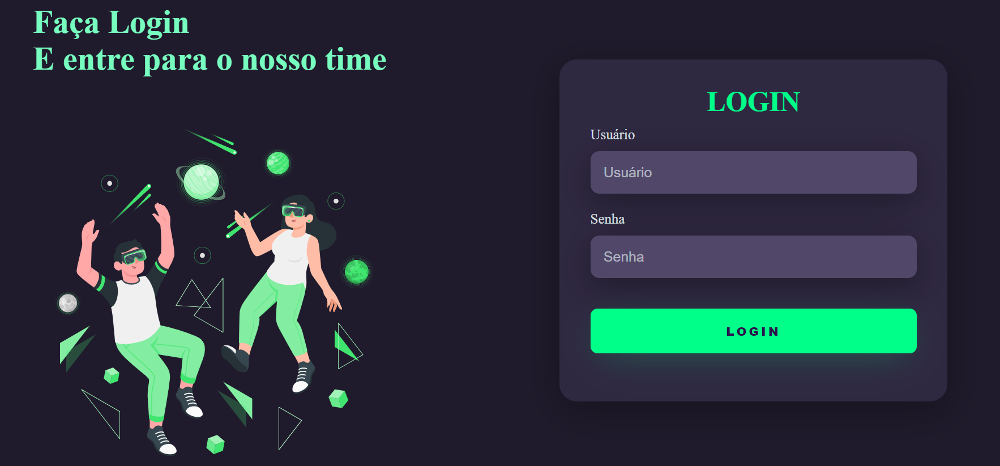

<h1 align="center">Login Dark FrontEnd</h1>

  <strong>Projeto de estudo para WebSite</strong>

  <a href="#instalação">Instalação</a> •
  <a href="#uso">Uso</a> •
  <a href="#contribuição">Contribuição</a> •
  <a href="#img projeto">Licença</a>

## Instalação

> Faça um Git clone do projeto na sua maquina
## Uso

> Baixe a extensão Live Server e abra o arquivo com o mesmo.

## Contribuição

> Foi usado as Docs do HTML e CSS.

## Img Projeto

